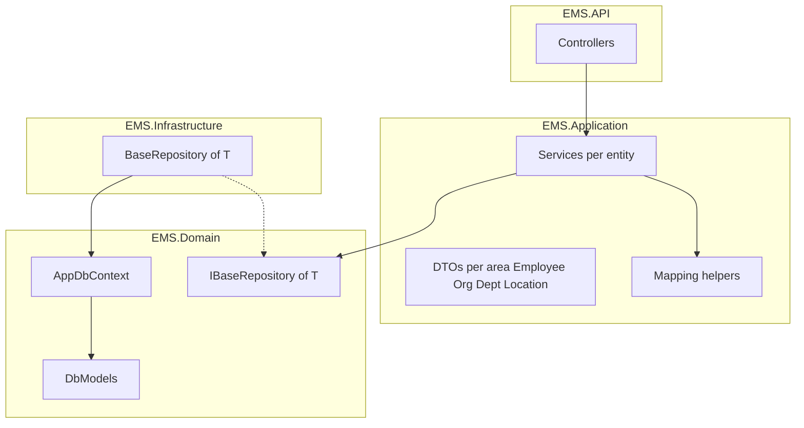

# EMS architecture (overview)

This document is a lightweight map of how requests flow through the solution today. Expand it when you add authentication, validation pipelines, or deployment-specific concerns.

## Layering

## Responsibility split

- **Controllers** accept HTTP requests and return DTOs; they do not reference EF Core or `DbContext` directly.
- **Application services** orchestrate use cases: load or create entities via `IBaseRepository<T>`, map to/from DTOs, call `SaveChangesAsync` through the repository.
- **Mappers** (static helpers in `EMS.Application/Mapping`) keep mapping logic in one place per aggregate.
- **Domain** owns persistence model, EF configuration, and migrations; **Infrastructure** implements `IBaseRepository<T>` using `AppDbContext`.

## DTO conventions

- DTOs live under `EMS.Application/DTOs` grouped by business area (e.g. `Employee/`, `Organization/`, `Department/`, `Location/`). Each folder holds that area’s create/update request models and response model(s); add more types to the same folder when new tables relate to that area.
- **Create** and **Update** use separate request types (`Create*RequestModel`, `Update*RequestModel`).
- **Read** uses `*ResponseModel` for both detail and list (list is the same shape repeated).
- Namespaces match folders: `EMS.Application.DTOs.Employee`, `EMS.Application.DTOs.Organization`, etc.
- DTOs contain scalars and enums only (no navigation properties); foreign keys are expressed as `int` / nullable `int` as appropriate.

## Dependency injection

Registrations live in `EMS.API/Program.cs`: open-generic `IBaseRepository<>` → `BaseRepository<>`, plus scoped application services per entity area.
