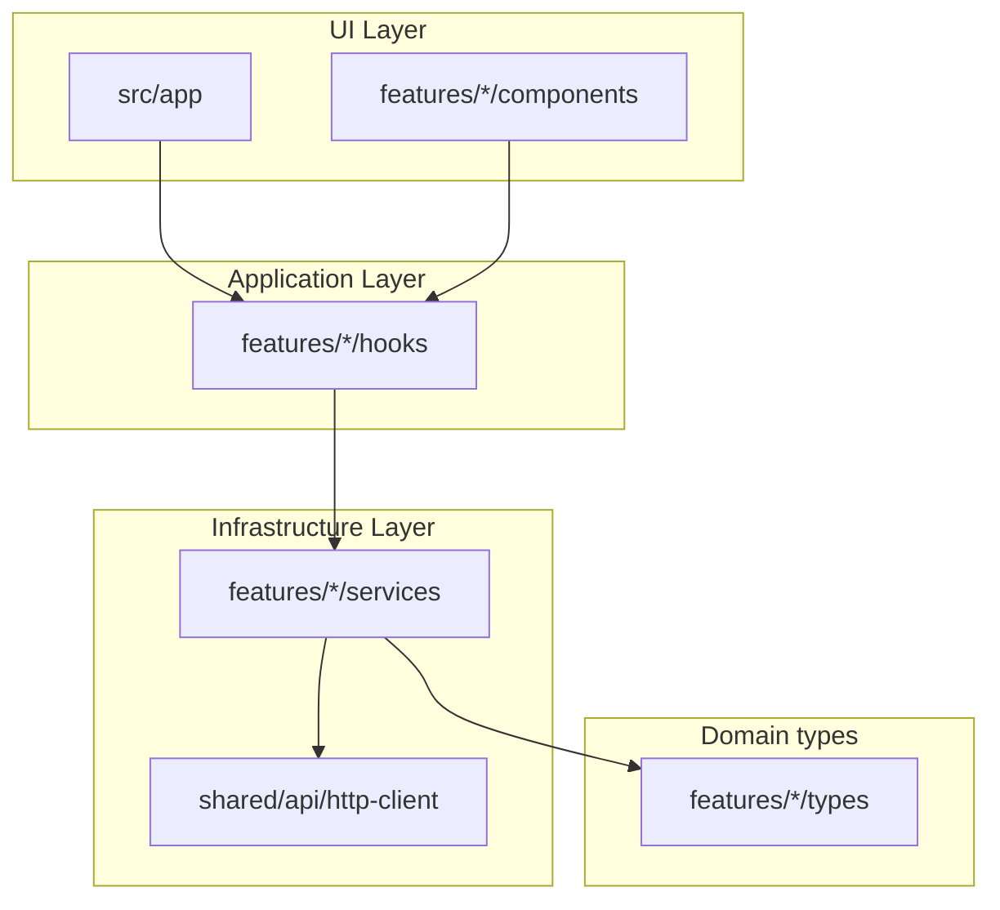

# EMS Web — Frontend documentation

This document describes the **Next.js** client in `ems-web`: architecture, configuration, and how it connects to **EMS.API**. For backend domains, migrations, and Docker infrastructure (SQL Server, MongoDB, etc.), see the [repository root README](../../README.md).

---

## 1. Purpose

The web app is a **browser UI** for managing employees against the existing REST API. It is structured for **parallel frontend work**: clear feature folders, typed DTOs aligned with the .NET API, and no direct HTTP calls inside presentational components.

---

## 2. Technology stack

| Area | Choice |
|------|--------|
| Framework | Next.js 16 (App Router), React 19 |
| Language | TypeScript (strict) |
| Styling | Tailwind CSS v4 |
| Server/async state | TanStack React Query v5 |
| Client/UI state | Zustand |
| HTTP | Axios (`src/shared/api/http-client.ts`) |
| Forms & validation | react-hook-form + Zod |
| Toasts | Sonner |

---

## 3. Layered architecture (Clean / onion-style)

Layers map loosely to the backend style: **types** first, **infrastructure** (HTTP), **application** (hooks = use cases), **UI** (pages & components).



**Rules**

- **UI** imports **hooks** and **store** only; it does not import Axios or raw `httpClient` (except shared primitives like `getErrorMessage` for display).
- **Hooks** call **services** and use React Query (`useQuery` / `useMutation`).
- **Services** are plain async functions: one module per feature area (e.g. `employeeService.ts`).
- **Types** mirror EMS.API JSON (camelCase) for that feature.

---

## 4. Folder structure

```
ems-web/
├── docs/
│   └── FRONTEND.md          ← this file
├── public/                   (static assets, if any)
├── src/
│   ├── app/                  App Router: layouts, pages, global CSS
│   │   ├── layout.tsx
│   │   ├── page.tsx
│   │   ├── globals.css
│   │   └── employees/
│   │       └── page.tsx
│   ├── features/
│   │   └── employees/
│   │       ├── components/   Feature UI (table, form, dialogs)
│   │       ├── hooks/        useEmployees, mutations, etc.
│   │       ├── services/     employeeService, query-keys
│   │       ├── store/        Zustand UI store
│   │       ├── types/        TS types + Zod schemas
│   │       └── utils/        e.g. date helpers
│   ├── providers/
│   │   └── ReactQueryProvider.tsx
│   └── shared/
│       ├── api/              http-client, error helpers
│       ├── components/       Button, Modal, Spinner
│       └── utils/            cn(), etc.
├── .env.example
├── Dockerfile
├── next.config.ts
├── package.json
└── README.md
```

When you add another bounded context (e.g. departments), add `src/features/departments/` with the same shape.

---

## 5. Environment variables

### Local development (`.env.local`)

Copy `.env.example` to `.env.local` (gitignored).

| Variable | Required | Description |
|----------|----------|-------------|
| `NEXT_PUBLIC_API_BASE_URL` | Yes | EMS.API base URL, **no trailing slash** (e.g. `http://localhost:5246` when using the `http` launch profile). |
| `NEXT_PUBLIC_DEFAULT_ORGANIZATION_ID` | Recommended | Default `organizationId` on create-employee flows; must exist in `org.Organizations`. |

`NEXT_PUBLIC_*` variables are inlined into the **browser bundle** at build time. After changing them, restart `npm run dev` or rebuild for production.

### Docker / `docker compose` build

When building the **`ems-web`** image from the solution root, `NEXT_PUBLIC_*` is passed as **Docker build args** (see `docker-compose.yml` and `docker-compose.env.example`). Changing them requires a **rebuild** of the image, not only restarting the container.

---

## 6. Running locally (recommended for development)

1. Start **EMS.API** (and database if not using Docker for SQL).
2. Ensure **CORS** on the API allows your web origin (this repo allows `http://localhost:3000` and `https://localhost:3000`).
3. In `ems-web`:

```bash
npm install
cp .env.example .env.local   # then edit URLs / org id
npm run dev
```

Open **http://localhost:3000**. Use **http://localhost:3000/employees** for the employees screen.

**Node.js:** Next.js 16 expects **Node ≥ 20.9** (`package.json` `engines`).

---

## 7. Docker (production-style image)

From the **solution root** (parent of `ems-web`):

```bash
docker compose up -d --build
```

On Windows you can use **`start-ems-docker.bat`** / **`stop-ems-docker.bat`**. The API is still expected to run on the **host** (`dotnet run …`) unless you add an API service to Compose separately.

`next.config.ts` sets `output: "standalone"` for the `Dockerfile` entrypoint (`node server.js`).

---

## 8. API alignment (Employees)

The client targets the same contracts as the backend:

| Method | Path | Notes |
|--------|------|--------|
| GET | `/api/Employees` | List |
| GET | `/api/Employees/{id}` | Detail |
| POST | `/api/Employees` | Create body matches create DTO |
| PUT | `/api/Employees/{id}` | Update |
| DELETE | `/api/Employees/{id}` | 204 on success |

Types live under `src/features/employees/types/`. Field names follow **camelCase** JSON (ASP.NET Core default). There is no `salary` field; job linkage is `jobPositionId` where applicable.

---

## 9. React Query conventions

- **Query keys** are centralized in `src/features/employees/services/query-keys.ts` (e.g. `['employees']`, `['employees', 'detail', id]`).
- **Mutations** invalidate list queries (and detail when updating) so lists stay fresh.
- **ReactQueryProvider** configures `QueryClient` defaults and mounts **React Query Devtools** in development (bottom-left) and **Sonner** toasts.

---

## 10. Zustand (UI-only state)

`src/features/employees/store/employee-ui-store.ts` holds **modal visibility**, **selected row for edit/delete**, and **form mode** (create vs edit). It does **not** perform HTTP; mutations stay in hooks.

---

## 11. Quality checks

```bash
npm run lint
npm run build
```

`npm run build` must succeed before relying on the Docker image.

---

## 12. Troubleshooting

| Symptom | Likely cause | What to try |
|---------|----------------|-------------|
| Overlay: “Error evaluating Node.js code” / `globals.css` | Tailwind v4 native binary missing (`@tailwindcss/oxide`) | Remove `node_modules` and `package-lock.json`, `npm install`, then `npm run build` again. |
| Network / CORS errors | API down or wrong `NEXT_PUBLIC_API_BASE_URL` | Confirm API URL in browser devtools; ensure API CORS policy includes `http://localhost:3000`. |
| `401` / `403` | Auth not implemented yet | Expected until you add authentication. |
| Docker web image stale env | `NEXT_PUBLIC_*` baked at **build** | Rebuild image: `docker compose build --no-cache ems-web`. |

---

## 13. Related documentation

| Document | Content |
|----------|---------|
| [ems-web/README.md](../README.md) | Short quick start in `ems-web` |
| [Root README](../../README.md) | Backend solution, Docker Compose overview, EMS.API |
| [docker-compose.env.example](../../docker-compose.env.example) | Optional Compose overrides for web build args |

---

## 14. Conventions checklist (new feature)

1. Add **types** under `features/<name>/types/`.
2. Add **service** functions calling `httpClient` only.
3. Add **query keys** and **hooks** (`useQuery` / `useMutation`).
4. Add **components**; wire **pages** under `src/app/`.
5. Keep **env-specific** URLs in `.env.local` / Compose build args, not hard-coded in components.
